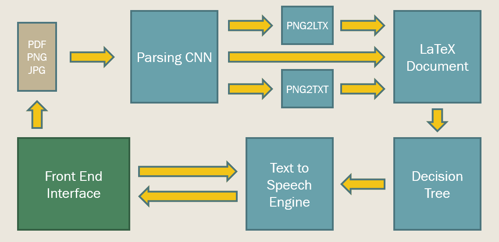

# Latex2Speech

As the COVID-19 epidemic continually shifts how we interact with one another through our digital devices, it has become evident that the constant exposure to screens dwindles to focus of the researcher. 
Long hours spent looking at code, reading websites and interfacing with one another through video and voice calls leaves the mind and eyes quite exhausted when it comes time to read articles. To aid with 
this, we have divised a system that can take in a generic PDF of an article, textbook, etc. and coverts it to an interactive audiobook. The goal of this project is to alleviate the strain from visual 
focus and allow the reader to relax with their eyes closed and listen to a paper that is read in a convenient way for understanding its contents.

The code is comprised of three major pieces. 
1. A CNN that parses a PNG/PDF document for text, math, and figures.
2. A translator that uses open source software to convert the parsed pdf into a full LATEX document.
3. A text to speech system tied to a decision tree that allows the user to listen along to the document at their own speed.

## Descriptive Video!

## Dependencies
This package is tested for python 3.7. It requires the following dependencies at the moment:
- Anaconda (installed from website)
- PyTorch 1.5.1 (CUDA 10.1 for training) (conda install pytorch torchvision cudatoolkit=10.1 -c pytorch)
- Pyttsx3 2.88 Ubuntu:(pip install pyttsx3) Windows:(pip install pywin32 pypiwin32 pyttsx3)
- For Ubuntu users we recommend Espeak as the audio engine for Pyttsx3. (sudo apt-get install espeak)
- For Windows users we recommend SAPI5 but it ships as part of the Windows OS as of Vista.

## CNN
The CNN is comprised of a data creator generate_data.py that creates a numpy array of black and white images of text and math as well as a 3 channel image that designates where the text and math is. Currently there is no support for figures and tables in this data generator and it is dependent on the folders text_data and equation_data. Data is generated with the `python generate_data.py` command. The CNN can be trained by executing `python model.py` but needs substantial modifications still.

## Translator

The translator takes in a text file containing the names of all the image files generatored by the CNN. It determines which files are images of text, images of math, or images of figures, then uses pytesseract and im2markup to convert the images of text and images of math to latex tex and math respectively. It then write this latex code to another text file for use by the TTS. Currently image of math to latex math does not work and code cannot properly converting text with special characters {, }, and \\.

## TTS 

The DocumentClasses.py file contains the various classes used to separate the elements of the file, namely the paragraphs, figures, and equations. It calls the `getEnglish()` function from TexToEnglish script to convert the equations into english words. The document now consists of a number of text, figure, and equation blocks which are then sent to the t2s.py script which creates a .mp3 file. Based on the user's input the mp3 file is made using various options such as adding pauses whenever a figure is referenced based.

## Web User Interface

The PodPaperApp.py is the controller of the entire application. It takes in data from the user via HTTP requests, passes it to the components above, and return a list of data back to the website. This data returned includes an MP3 file as well as timestamps for each paragraph and figure that indicate the part of the MP3 where that paragraph or figure starts.
Most of the static UI elements are implemented. However, there are things that are not implemented here as well. This include the RESTful interface, the responcive web design, and the logic class for managing the MP3 file.
All static web files are located in resources/static_web_files
