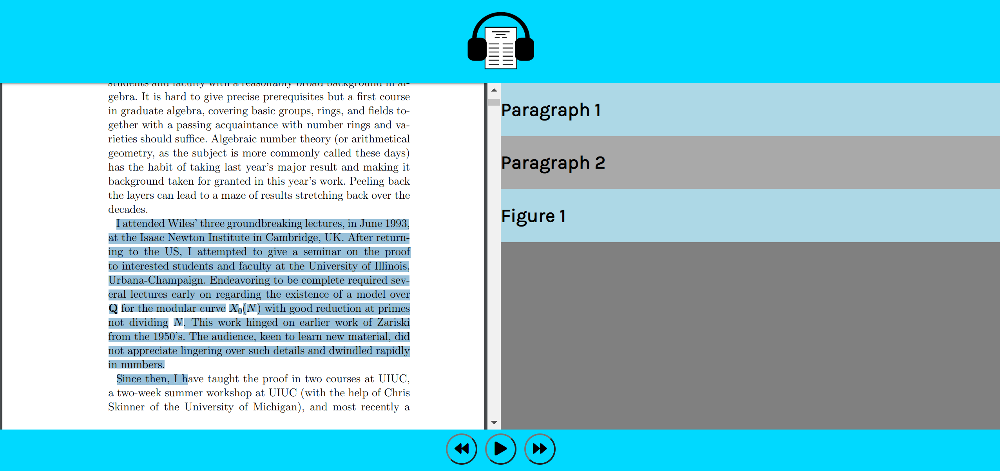

# Latex2Speech

As the COVID-19 epidemic continually shifts how we interact with one another through our digital devices, it has become evident that the constant exposure to screens dwindles to focus of the researcher. 
Long hours spent looking at code, reading websites and interfacing with one another through video and voice calls leaves the mind and eyes quite exhausted when it comes time to read articles. To aid with 
this, we have divised a system that can take in a generic PDF of an article, textbook, etc. and coverts it to an interactive audiobook. The goal of this project is to alleviate the strain from visual 
focus and allow the reader to relax with their eyes closed and listen to a paper that is read in a convenient way for understanding its contents.

This package is tested for python 3.7. It requires the following dependencies at the moment:
- Anaconda (installed from website)
- PyTorch 1.5.1 (CUDA 10.1 for training) (conda install pytorch torchvision cudatoolkit=10.1 -c pytorch)
- Pyttsx3 2.88 Ubuntu:(pip install pyttsx3) Windows:(pip install pywin32 pypiwin32 pyttsx3)
- For Ubuntu users we recommend Espeak as the audio engine for Pyttsx3. (sudo apt-get install espeak)
- For Windows users we recommend SAPI5 but it ships as part of the Windows OS as of Vista.

The code is comprised of three major pieces. 
1. A CNN that parses a PNG/PDF document for text, math, and figures.
2. A translator that uses open source software to convert the parsed pdf into a full LATEX document.
3. A text to speech system tied to a decision tree that allows the user to listen along to the document at their own speed.

## CNN

## Translator

The translator takes in a text file containing the names of all the image files generatored by the CNN. It determines which files are images of text, images of math, or images of figures, then uses pytesseract and im2markup to convert the images of text and images of math to latex tex and math respectively. It then write this latex code to another text file for use by the TTS. Currently image of math to latex math does not work and code cannot properly converting text with special characters {, }, and \.

## TTS 
